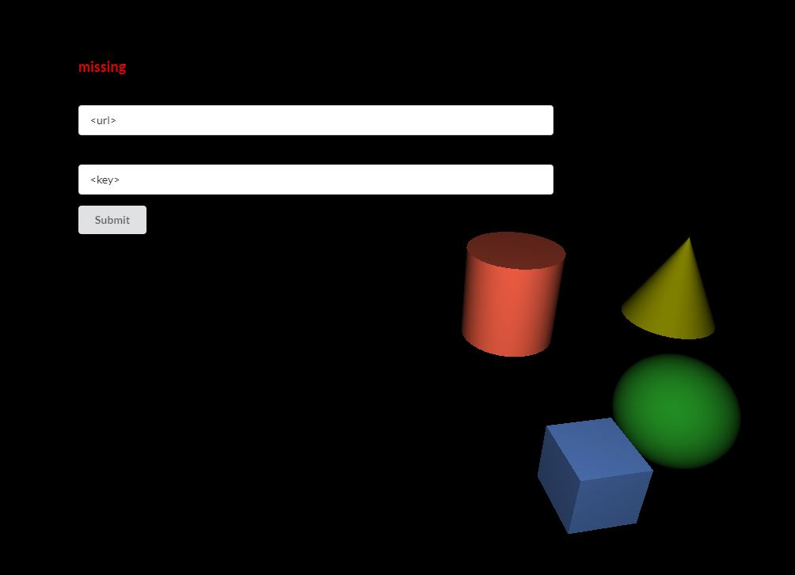

# Aardvark.UI.Screenshotr

With the Aardvark.UI.Screenshotr you can take screenshots from your Aardvark.Media application and upload it to a screenshotr server.

The first time you take a screenshot your are asked to enter the credentials (url and api-key) for the server-connection. 



Then you can enter the image size and specify some tags. Multiple tags are separated with a semicolon and some special characters are filtered.


---

## How to make it work with my aardvark.media application

1. Add the [Aardvar.UI.Screenshotr nuget package](https://www.nuget.org/) to your project. (Note: its not existing yet!)

2. Add these code-snippets to your program:

    * Step 1: Add a ScreenshotrMessage to your Message
    ```fsharp
    type Message =
        | ScreenshoterMessage of ScreenshotrMessage
    ```

    * Step 2: Add a ScreenshotrModel to your Model
    ```fsharp
    type Model =
        {
            screenshotr : ScreenshotrModel 
        }
    ```
    * Step 3: Initialize the ScreenshotrModel with your aardvark.media application url. You find the url in the Program.fs.  If you don't want to copy&paste it, take a look into the code how to pass it from the Program.fs to the initialization. 
    ```fsharp
    let initial = 
        { 
            screenshotr = ScreenshotrModel.Default url 
        }
    ```
    * Step 4: add the ScreenshotrMessage to your update function
    ```fsharp
     let update (m : Model) (msg : Message) =
        match msg with
        | ScreenshoterMessage msg -> { m with screenshotr = ScreenshotrUpdate.update msg m.screenshotr }
    ```
    * Step 5: add some key (or button) bindings in your update function
    ```fsharp
     let update (m : Model) (msg : Message) =
        match msg with
        | Message.KeyDown k -> 
            match k with
            | Keys.F8 -> { m with screenshotr = m.screenshotr |> ScreenshotrUpdate.update ToggleScreenshotUi }
    ```
    * Step 6: add the screenshotr UI 
    ```fsharp
    body [] [
        ScreenshotrView.screenshotrUI m.screenshotr |> UI.map ScreenshoterMessage
    ]
    ```


