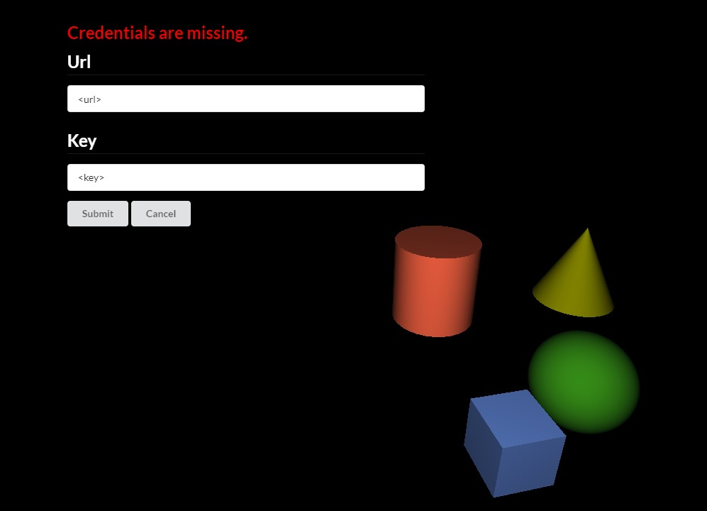
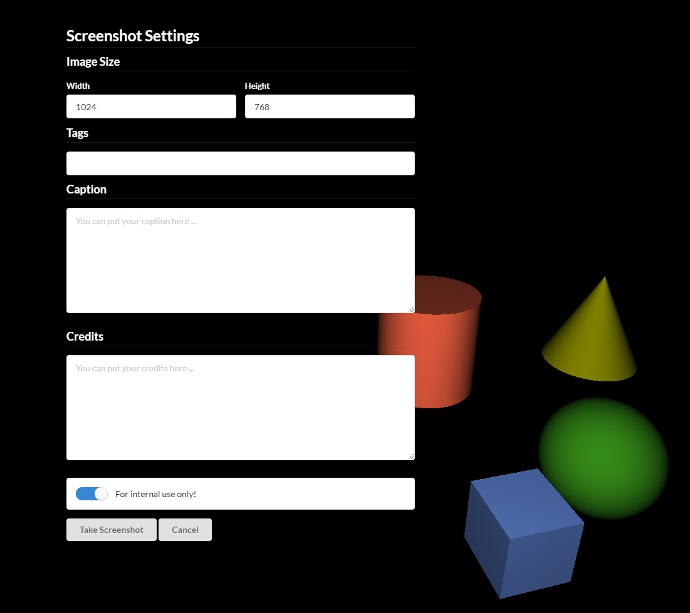

# Aardvark.UI.Screenshotr

With the Aardvark.UI.Screenshotr you can take screenshots from your Aardvark.Media application and upload it to a screenshotr server.

The first time you take a screenshot you are asked to enter credentials (url and api-key) for the server-connection. 
<br/>

Then you can specify an image size and some tags. Multiple tags are separated with a semicolon. Note, some special characters are filtered.
<br/>

---

## How to make it work with my Aardvark.Media application

1. Add the [Aardvark.UI.Screenshotr nuget package](https://www.nuget.org/packages/Aardvark.UI.Screenshotr) to your project. 

2. Add these code-snippets to your program:

    * **Step 1:** Add a `ScreenshotrMessage` to your `Message`
    ```fsharp
    type Message =
        | ScreenshotrMessage of ScreenshotrMessage
    ```

    * **Step 2:** Add a `ScreenshotrModel` to your `Model`
    ```fsharp
    type Model =
        {
            screenshotr : ScreenshotrModel 
        }
    ```
    * **Step 3:** Initialize the `ScreenshotrModel` with your Aardvark.Media application url.

    ```fsharp
    let initial (url : string) = 
        { 
            screenshotr = ScreenshotrModel.Default url 
        }
    ```
    How to pass the Aardvark.Media application url from the `Program.fs` to the initialization:

    Updated app function in `App.fs`
    ```fsharp
    let app (myUrl : string) =
        {
            initial = initial myUrl
            update = update
            view = view
            threads = fun m -> m.cameraState |> FreeFlyController.threads |> ThreadPool.map CameraMessage
            unpersist = Unpersist.instance
        }
    ```

    Minimal `Program.fs` example: 
    ```fsharp
    let main args =

        Aardvark.Init()
        Aardium.init()

        let app = new OpenGlApplication()

        let port = 1337 
        let mediaUrl = sprintf "http://localhost:%i/" port
        
        WebPart.startServerLocalhost port [
            MutableApp.toWebPart' app.Runtime false (App.start (App.app mediaUrl))
        ] |> ignore
        
        Aardium.run {
            title "Screenshotr Example"
            width 1024
            height 768
            url mediaUrl
        }
    ```

    * **Step 4:** add the `ScreenshotrMessage` to your update function
    ```fsharp
     let update (m : Model) (msg : Message) =
        match msg with
        | ScreenshotrMessage msg -> { m with screenshotr = ScreenshotrUpdate.update msg m.screenshotr }
    ```
    * **Step 5:** add some key (or button) bindings in your update function
    ```fsharp
     let update (m : Model) (msg : Message) =
        match msg with
        | Message.KeyDown k -> 
            match k with
            | Keys.F8 -> { m with screenshotr = m.screenshotr |> ScreenshotrUpdate.update ToggleScreenshotUi }
    ```
    * **Step 6:** add the screenshotr UI to your UI
    ```fsharp
    body [] [
        ScreenshotrView.screenshotrUI m.screenshotr |> UI.map ScreenshotrMessage
    ]
    ```

---

## FAQ:

* **Do I need to use the Screenshotr UI?**
    
    No, you don't have to. Omit Step 4 and Step 6, and change Step 5 to this function call:
    ```fsharp
    let update (m : Model) (msg : Message) =
    match msg with
    | Message.KeyDown k -> 
        match k with
        | Keys.F8 -> { m with screenshotr = m.screenshotr |> ScreenshotrUpdate.update TakeScreenshot }
    ``` 
    If you want to set a default image size and tags change Step 3 like that:
    ```fsharp
    let initial = 
    { 
        screenshotr = ScreenshotrModel.Custom url (V2i(1024,768)) [ "my"; "custom"; "default"; "tags" ]
    }
    ```

* **I don't have an Aardvark.Media application. Can I use the Screenshotr service nevertheless?**
    
    Yes, if you know how to take a screenshot from your application. The Screenshotr service requires the image as a byte[]. Take a look at the [Screenshotr repository](https://github.com/aardvark-community/screenshotr).

* **I want to use the Screenshotr.UI and don't want to manually add some default tags everytime. How do I do that?**

    Yes, just change the code from Step 3 to this:
     ```fsharp
    let initial = 
    { 
        screenshotr = ScreenshotrModel.Custom url (V2i(1024,768)) [ "my"; "custom"; "default"; "tags" ]
    }
    ```


    


